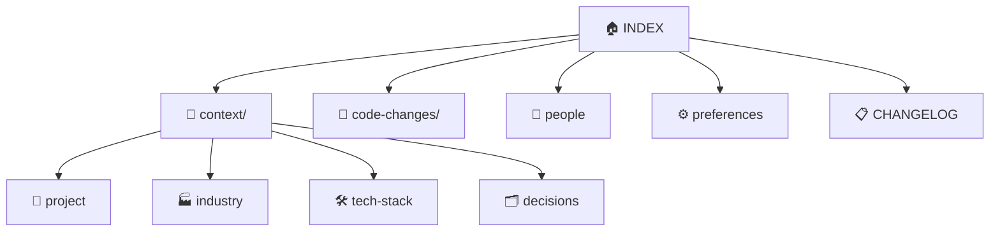

# Memory Index

> [!abstract] Vault entry point. Start here to navigate all stored context.
> Populated by `/memorise` — run it in Claude Code to capture recent work.

---

## Vault Map



---

## Sections

| Note | Purpose |
|------|---------|
| [[project]] | Project goals, constraints, stakeholders |
| [[industry]] | Domain and industry knowledge learned |
| [[tech-stack]] | Languages, frameworks, conventions, gotchas |
| [[decisions]] | Architectural and design decision log |
| [[people]] | Team members, contributors, stakeholders |
| [[preferences]] | Coding style and workflow preferences |
| [[CHANGELOG]] | Log of all `/memorise` runs and memory updates |

---

## Recent Code Changes

%%Updated automatically by /memorise — do not edit this section manually%%

| Date | Summary |
|------|---------|
| _(none yet)_ | Run `/memorise` to begin capturing |

---

## Tag Index

| Tag | Notes |
|-----|-------|
| `#decision` | [[decisions]] |
| `#pattern` | [[tech-stack]] |
| `#domain` | [[industry]] |
| `#preference` | [[preferences]] |
| `#person` | [[people]] |
| `#tech` | [[tech-stack]] |
| `#index` | [[INDEX]] |

---

## How to Use

```
/memorise           capture the past 24 hours (default)
/memorise 48h       capture the past 48 hours
/memorise 7d        capture the past 7 days
/memorise 2026-04-01   capture since a specific date
```

> [!tip] Open `memory/` as an Obsidian vault to browse the graph view, search tags, and navigate wikilinks interactively.

_Memory is updated on demand — it is not automatic._
